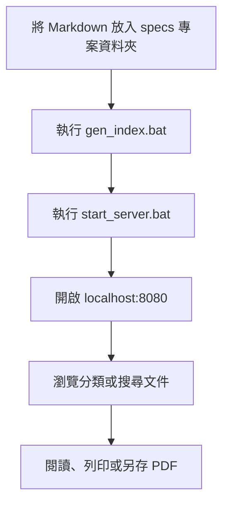

# 規格文件庫使用者操作手冊

規格文件庫是一個純前端、無資料庫的 Markdown 文件入口網站。它會讀取 `specs` 資料夾中的規格文件，提供專案分類、全文搜尋、文件目錄、流程圖、程式碼區塊、深色模式與列印／另存 PDF 功能。

目前介面採黑白簡約風格，適合在本機、內網或 IIS 中瀏覽。

## 快速開始

### 第一次使用

1. 確認已將規格文件放在 `specs\專案名稱\` 底下，檔案格式為 `.md`。
2. 雙擊 `tools\gen_index.bat`，重新產生文件索引。
3. 雙擊 `start_server.bat`。
4. 瀏覽器會自動開啟 `http://localhost:8080`；若沒有自動開啟，請手動輸入此網址。

`start_server.bat` 會優先使用系統 PATH 中的 `python.exe`，找不到時依序嘗試 `py.exe`、常見 Python 安裝位置，以及 Node.js 的 `npx serve`。一般情況不需要修改批次檔。

> 請勿直接雙擊 `index.html`。直接以 `file://` 開啟時，瀏覽器可能阻擋 `fetch()`，導致索引與文件無法載入。

### 關閉網站

回到啟動網站的命令視窗，按 `Ctrl+C` 停止本機伺服器；若畫面詢問是否終止批次工作，請依提示確認。

## 整體使用流程



## 介面區域

- 頂端標題：顯示網站名稱與副標題。
- 搜尋列：搜尋所有已載入的規格文件。
- 左側文件目錄：依專案分類顯示文件，可展開或收合分類。
- 中央內容區：顯示首頁卡片或選取的 Markdown 文件。
- 右側本頁目錄：閱讀文件時，依標題產生快速導覽。
- 頂端工具列：提供「展開」、「列印」與「主題」功能。

## 瀏覽文件

1. 在首頁點選專案卡片中的文件，或展開左側專案後點選文件。
2. 閱讀中央內容區的規格內容。
3. 文件標題較多時，使用右側「本頁目錄」跳到指定段落。
4. 流程圖若提供原始碼，可按「原始碼」查看，再按「收合」隱藏。
5. 程式碼區塊可按「複製」複製內容。

文件頁底部會顯示實際檔案位置，例如 `specs\LCR\SPEC-LCR控管系統-MVP.md`，方便維護者定位原始檔案。

## 新增或更新文件

```text
specs\
└─ 專案名稱\
   ├─ SPEC.md
   └─ 其他規格文件.md
```

操作步驟：

1. 在 `specs` 下建立或選取專案子資料夾。
2. 將 `.md` 檔案放入該子資料夾。
3. 建議在 Markdown 前段放置第一個 `# 標題`，網站會用它作為文件顯示名稱。
4. 執行 `tools\gen_index.bat`，讓索引反映新增、刪除、搬移或改名的文件。
5. 重新整理瀏覽器頁面。

沒有第一個 Markdown 標題時，網站會以檔名（去除 `.md`）顯示。

## 搜尋與篩選

- 在頂端搜尋列輸入關鍵字，即可搜尋文件標題、專案名稱與文件內容。
- 中文搜尋支援 bi-gram；中英文與數字也可混合搜尋。
- 按 `Ctrl+K` 可快速聚焦搜尋列。
- 按 `Esc` 可清空搜尋並關閉結果。
- 搜尋結果最多顯示 25 筆；點選結果即可開啟對應文件。

網站啟動後會在背景載入文件內容建立搜尋索引。若立即搜尋時顯示「索引建立中，請稍候…」，等待片刻後再試即可。

## 外觀與列印

### 主題

按頂端「主題」切換淺色與深色模式。選擇會記錄在目前瀏覽器的 `localStorage`（索引鍵為 `spec-theme`），下次開啟同一瀏覽器時會保留。

### 列印或另存 PDF

1. 開啟要輸出的文件。
2. 按頂端「列印」。
3. 在瀏覽器列印視窗選擇實體印表機，或選擇「另存為 PDF」。

列印版面會自動隱藏頂端工具列、左側目錄、右側本頁目錄與部分操作按鈕。

## 資料保存與備份


- 原始文件保存在專案內的 `specs` 資料夾。
- 分類與文件清單保存在自動產生的 `spec-index.json`。
- 網站不使用資料庫，也不會把文件內容保存到瀏覽器資料庫。
- 備份時請至少保留 `specs`、`spec-index.json`、`index.html`、`assets` 與啟動／索引工具。
- 新增、刪除、搬移或改名文件後，務必重新執行索引產生器。

## 離線、隱私與限制

- 網站不依賴 CDN；在沒有外網的內網環境仍可運作。
- 本機預覽伺服器只提供目前資料夾內容，文件不會自動上傳外部服務。
- 若部署到 IIS，網站會依 `web.config` 提供靜態檔案與預設文件設定。
- 支援 Chrome、Edge、Firefox 等現代瀏覽器，不支援 IE11。

## 常見問題

### 畫面顯示「無法載入 spec-index.json」

確認瀏覽器網址是 `http://localhost:8080`，不是以 `file://` 開頭；接著確認 `spec-index.json` 位於專案根目錄，並重新執行 `start_server.bat`。

### 新文件沒有出現在網站

確認檔案副檔名是 `.md`，且位於 `specs\專案名稱\`；再執行 `tools\gen_index.bat` 並重新整理頁面。

### 啟動時顯示連接埠已被占用

關閉其他使用 8080 的本機伺服器，或在 `start_server.bat` 將 `PORT=8080` 改成未使用的連接埠，例如 `8081`，再以 `http://localhost:8081` 開啟。

### 批次檔找不到 Python

在命令提示字元執行 `where python` 或 `where py` 確認 Python 是否已加入系統 PATH。若電腦沒有 Python，啟動器會嘗試使用 Node.js 的 `npx serve`；兩者皆不存在時，請先安裝其中一項，再重新執行批次檔。

### 已更新配色但瀏覽器仍顯示舊畫面

按 `Ctrl+Shift+R` 強制重新整理，或關閉舊的 `localhost:8080` 分頁後重新執行 `start_server.bat`。本頁樣式表使用版本參數避免快取沿用舊 CSS。

## 維護者驗證

以下檢查不屬於一般使用者操作：

```powershell
# 重新產生索引
cmd /c tools\gen_index.bat

# 啟動本機靜態伺服器
cmd /c start_server.bat
```

完成後確認：

1. `spec-index.json` 能被瀏覽器載入。
2. 首頁的專案與文件數量符合 `specs` 實際內容。
3. 搜尋、文件開啟、流程圖、主題切換與列印功能正常。
4. `index.html` 使用目前版本的 `assets/css/style.css`。

## 目錄結構

```text
spec-sketch/
├─ index.html              網站入口
├─ spec-index.json         文件索引（由工具產生）
├─ start_server.bat        本機預覽啟動器
├─ web.config              IIS 靜態網站設定
├─ assets/
│  ├─ css/style.css        黑白簡約介面樣式
│  └─ js/
│     ├─ app.js            路由、選單、主題與頁面邏輯
│     ├─ diagram.js        Mermaid flowchart 語法子集繪圖
│     ├─ md.js             Markdown 解析與程式碼高亮
│     └─ search.js         中文 bi-gram 全文搜尋
├─ specs/                  Markdown 規格文件
└─ tools/
   ├─ gen_index.bat        Windows 索引產生器
   ├─ gen_index.py         Python 索引產生器
   └─ gen_index.ps1        PowerShell 備援索引產生器
```
