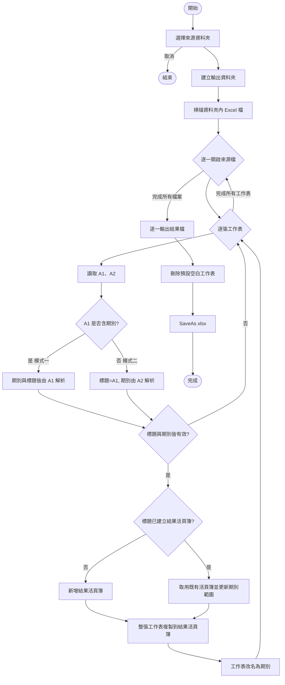

---
created: 2026-07-22
tags:
  - spec
  - vibecoding
  - excel
  - vba
  - finance
---

# SPEC.md — 批次整理報表（自動判斷版）

## 1. 文件資訊

| 項目 | 內容 |
|------|------|
| 專案名稱 | 批次整理報表（逾放報表彙整巨集，自動判斷版） |
| 巨集入口 | `批次整理報表_自動判斷` |
| 開發語言 | VBA (Excel Macro) |
| 版本 | V2.0 |
| 適用檔案 | 逾放月報表 與 二年內逾放明細表 兩類來源檔 |
| 文件狀態 | 已驗證通過 |

---

## 2. 目的與背景

信用風險例行性工作每期（月）產生多種逾期放款報表，來源格式有兩類：

- **月報型**：`A1` 為報表標題、`A2` 為報表日期。
- **明細表型**：`A1` 同時包含期別與報表標題（無獨立日期欄）。

本工具將指定資料夾內多個來源檔，**自動判斷格式**後依「報表標題」分群，把同一種報表各期別彙整成單一 `.xlsx` 結果檔，以利趨勢比對與查核。

---

## 3. 名詞定義

| 名詞 | 定義 |
|------|------|
| 來源檔 | 資料夾內原始報表 Excel 檔（`.xlsx` / `.xlsm` / `.xls`） |
| 報表標題 | 分群依據，依格式從 `A1` 取得（明細表型需去期別與括號） |
| 報表日期 | 月報型的 `A2` 內容（民國年格式） |
| 期別 | 5 碼字串，格式 `YYYMM`（民國年3碼＋月2碼），如 `11506` |
| 結果檔 | 依報表標題彙整後輸出的 `.xlsx` 檔 |

---

## 4. 自動判斷規則

| 模式 | 判斷條件 | 期別來源 | 標題來源 |
|------|----------|----------|----------|
| 模式一：明細表型 | `A1` 含「○○○年○月」（年月間為數字） | 由 `A1` 解析 | `A1` 去期別前綴、去括號分類 |
| 模式二：月報型 | `A1` 不含期別 | 由 `A2` 日期解析 | `A1` 全文 |

判斷函式：`HasPeriodInText(A1)` — 檢查「年」「月」之間是否為數值，是則走模式一，否則走模式二。

---

## 5. 功能需求（Functional Requirements）

### FR-1 選擇來源資料夾
- 以資料夾選擇對話框（`msoFileDialogFolderPicker`）指定來源資料夾。
- 取消時程式結束且不產出檔案。

### FR-2 掃描來源檔
- 掃描資料夾內 `.xlsx`、`.xlsm`、`.xls` 檔。
- 忽略暫存檔（前綴 `~$`）。

### FR-3 自動判斷與解析
- 逐一開啟來源檔（唯讀），逐張工作表讀取 `A1`、`A2`。
- 依第 4 節規則自動判斷模式，解析出報表標題與期別。
- `A1`、`A2` 為合併儲存格時仍正確讀取（值存於左上角）。

### FR-4 期別轉換
- 民國年月轉 5 碼期別。
- 範例：`115年6月…` → `11506`；`114年7月31日` → `11407`。

### FR-5 標題正規化（模式一）
- 去除開頭「○○○年○月」期別前綴。
- 去除結尾括號分類（半形 `(...)` 與全形 `（...）`）。
- 範例：`115年6月逾期放款中最近2年新爭取客戶逾期放款明細表(企業+個人)`
  → `逾期放款中最近2年新爭取客戶逾期放款明細表`

### FR-6 分群彙整
- 依報表標題分群，相同標題各期別彙整至同一結果活頁簿。
- 每張工作表以期別命名（如 `11506`）。

### FR-7 輸出結果檔
- 於來源資料夾下建立子資料夾 `報表結果_yyyymmdd_hhnnss`。
- 檔名格式：`報表標題(開始期別~結束期別).xlsx`。

### FR-8 格式保留
- 以整張工作表複製，完整保留合併儲存格、框線、圈選、圖形、欄寬列高。

---

## 6. 輸入規格（Input Spec）

### 6.1 模式一：明細表型
| 儲存格 | 內容 | 範例 |
|--------|------|------|
| A1 | 期別＋報表標題 | 115年6月逾期放款中最近2年新爭取客戶逾期放款明細表(企業+個人) |

### 6.2 模式二：月報型
| 儲存格 | 內容 | 範例 |
|--------|------|------|
| A1 | 報表標題 | 逾期放款分析表-最近二年新貸客戶 |
| A2 | 報表日期 | 114年7月31日 |

**日期／期別可接受格式**：`○○○年○月○日`、`○○○年○月`、`114/7/31`、`114.7`、`114-7`。
若無法解析出標題或期別，該工作表略過不處理。

---

## 7. 輸出規格（Output Spec）

### 7.1 輸出資料夾
```
<來源資料夾>\報表結果_yyyymmdd_hhnnss\
```

### 7.2 結果檔命名
```
<報表標題>(<最小期別>~<最大期別>).xlsx
```
- 檔名非法字元（`\ / : * ? " < > |`）一律以半形空白取代。

### 7.3 工作表命名
- 以期別命名，例：`11407`、`11408` … `11506`。

---

## 8. 處理邏輯（Processing Logic）



### 關鍵設計決策
- **整張工作表複製**（`Worksheet.Copy`）避免合併儲存格觸發 `錯誤 1004`。
- **唯讀開檔** 並加 `IgnoreReadOnlyRecommended:=True`，避免提示中斷。
- **`UpdateLinks:=False`** 避免外部連結更新造成延遲或錯誤。
- **格式判斷放在讀取階段**，一支巨集相容兩種來源檔。

---

## 9. 非功能需求（Non-Functional Requirements）

| 編號 | 需求 |
|------|------|
| NFR-1 | 執行期間顯示進度（狀態列：處理中 n/總數 + 檔名） |
| NFR-2 | 執行期間關閉畫面更新、警示、事件，以提升效能 |
| NFR-3 | 發生錯誤時關閉已開啟來源檔並還原應用程式設定 |
| NFR-4 | 輸出資料夾以時間戳命名，不覆蓋既有結果 |

---

## 10. 函式清單（API Reference）

| 函式 | 參數 | 回傳 | 說明 |
|------|------|------|------|
| `批次整理報表_自動判斷` | 無 | — | 主程序 |
| `HasPeriodInText(s)` | 文字 | Boolean | 判斷字串是否含「○○○年○月」期別 |
| `GetPeriodFromText(s)` | 文字 | String | 解析民國年月為 5 碼期別 |
| `GetTitleFromA1(s)` | 文字 | String | 去期別前綴與括號分類，取報表標題 |
| `IsExcelFile(FName)` | 檔名 | Boolean | 判斷是否為 Excel 檔 |
| `RemoveDefaultSheet(wb)` | 活頁簿 | — | 刪除空白預設工作表 |
| `CleanFileName(S)` | 文字 | String | 過濾檔名非法字元 |

---

## 11. 錯誤處理（Error Handling）

| 情境 | 行為 |
|------|------|
| 使用者取消資料夾選擇 | 直接結束，不報錯 |
| 工作表改名衝突（同標題同期別） | 名稱衝突中斷並提示 |
| 標題或期別解析失敗 | 該工作表略過 |
| 未預期錯誤 | 跳至 `ERROR_HANDLER`，關閉來源檔、還原設定、顯示錯誤碼與訊息 |

---

## 12. 已知限制（Known Limitations）

1. **標題含年月字樣的月報**：若月報型 A1 標題剛好含「○○年○月」，會被誤判為明細表型。現行月報標題不含年月字樣，暫無影響。
2. **同報表同期別重複**：同一結果檔出現相同標題且相同期別，會因工作表重名而中斷。
3. **標題中間的括號**：模式一自第一個括號截斷，若標題中間含非分類括號會被誤截。
4. **跨檔公式**：整張複製後可能保留來源檔連結，需另行轉純值。

---

## 13. 測試案例（Test Cases）

| 編號 | 情境 | 輸入 | 預期結果 |
|------|------|------|----------|
| TC-1 | 月報型 | A1=標題、A2=114年7月31日 | 期別 11407，標題=A1 全文 |
| TC-2 | 明細表型 | A1=115年6月…明細表(企業+個人) | 期別 11506，標題去期別去括號 |
| TC-3 | 混合資料夾 | 同時含兩類來源檔 | 各自分群、各自輸出結果檔 |
| TC-4 | 合併儲存格 | 報表含大量合併格 | 無 1004 錯誤，格式保留 |
| TC-5 | 解析失敗 | A1 空白或無期別且 A2 非日期 | 該工作表略過 |
| TC-6 | 取消操作 | 資料夾選擇按取消 | 程式結束，無產檔 |

---

## 14. 操作步驟摘要

1. 按 `Alt + F11` 進入 VBA 編輯器。
2. 插入 → 模組，貼上巨集程式碼。
3. 按 `Alt + F8`，選「批次整理報表_自動判斷」→ 執行。
4. 選擇來源資料夾。
5. 完成後至 `報表結果_日期時間` 資料夾檢視結果。

---

## 15. 版本紀錄

| 版本 | 日期 | 說明 |
|------|------|------|
| V1.0 | 2026-07-22 | 首版；月報型（A1 標題、A2 日期），整張複製解決 1004 |
| V1.1 | 2026-07-22 | 新增明細表型（A1 含期別與標題）處理 |
| V2.0 | 2026-07-22 | 整合為自動判斷版，一支巨集相容兩類來源檔 |