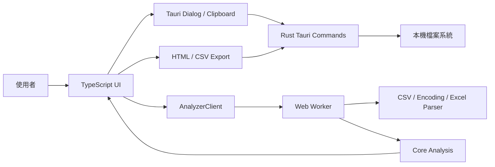
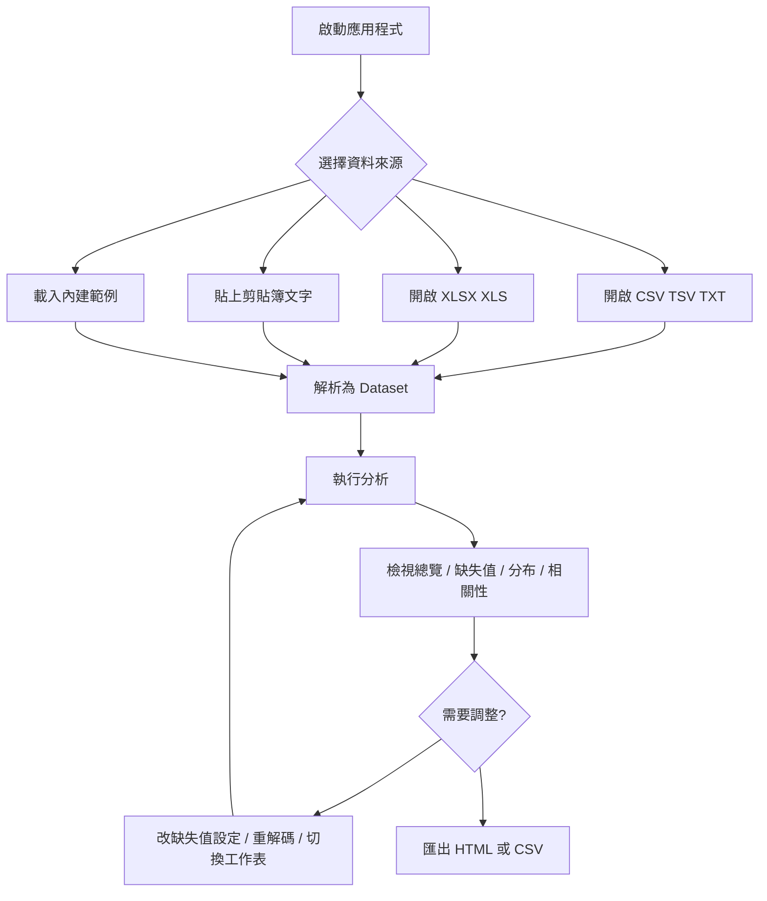

# Next Data Analyzer 系統流程與規格

## 1. 系統目標

Next Data Analyzer 是一套本機優先的資料分析工具，用於匯入表格資料、推斷欄位型別、分析缺失值與分布、計算數值欄相關性，並輸出 HTML 視覺化報告或 CSV 欄位統計摘要。

本專案交付型態包含：

- Vite + TypeScript 網頁前端。
- Tauri Windows 桌面應用程式。
- NSIS Windows 安裝檔。
- 可雙擊執行的桌面建置批次檔 `build-desktop.bat`。

## 2. 系統架構



### 2.1 前端層

- `src/main.ts` 管理應用狀態、分頁切換、開檔、剪貼簿、缺失值設定、編碼重解碼與匯出事件。
- `src/ui/` 負責畫面渲染：總覽、缺失值、分布、相關性、報告、圖表與 DOM helper。
- `src/io/load.ts` 提供 `AnalyzerClient`，封裝主執行緒與 Web Worker 的 request / response 流程。

### 2.2 分析層

- `src/worker/analyze.worker.ts` 保存目前資料集、原始 buffer、Excel workbook、作用中工作表與編碼狀態。
- `src/io/csv.ts` 使用 PapaParse 解析分隔文字，第一列作為欄名，空欄名補為 `(未命名)`，重複欄名加上序號。
- `src/io/encoding.ts` 偵測 UTF-8 BOM、UTF-16LE、UTF-8 與 Big5，並支援強制重解碼。
- `src/io/excel.ts` 使用 `xlsx` 讀取 XLSX / XLS，並將儲存格正規化為字串資料集。
- `src/core/` 提供型別推斷、缺失值、統計、日期分布、類別統計與相關係數計算。

### 2.3 桌面層

- `src-tauri/src/lib.rs` 提供 Tauri commands：
  - `read_file_bytes(path)`：讀取本機檔案 bytes。
  - `save_file_bytes(path, bytes)`：寫入本機檔案 bytes。
- 檔案讀取上限為 `512 * 1024 * 1024` bytes。
- Tauri 設定檔位於 `src-tauri/tauri.conf.json`，目前 bundle target 為 `nsis`。

## 3. 使用者流程



## 4. 功能規格

### 4.1 資料匯入

| 來源 | 支援規格 |
| --- | --- |
| CSV / TSV / TXT | 由 PapaParse 解析，跳過貪婪空白列；第一列為欄名。 |
| XLSX / XLS | 讀取活頁簿，預設使用第一張工作表；多工作表時可切換。 |
| 剪貼簿 | 讀取表格文字後以分隔文字流程解析。 |
| 內建範例 | `src/assets/samples/sample-utf8.csv`、`sample-big5.csv`。 |

載入新資料會取代目前資料與分析結果。一次只分析一份資料或一張工作表。

### 4.2 編碼處理

自動偵測順序：

1. UTF-8 BOM。
2. UTF-16LE BOM。
3. fatal UTF-8。
4. Big5。
5. UTF-8 replacement fallback。

只有 CSV 類型保留原始 bytes 並支援 `redecode`。Excel 與剪貼簿資料不提供重解碼。

### 4.3 分析輸出

`analyze(dataset, options)` 輸出 `AnalysisResult`，包含：

- 資料名稱、列數、欄數。
- 欄位型別：`integer`、`number`、`date`、`boolean`、`text`。
- 缺失數、缺失率、不重複值數量。
- 數值統計：平均、中位數、標準差、四分位、最小/最大、偏度、峰度、IQR 離群與 z-score 離群。
- 類別統計：類別數、最高頻類別、截斷狀態。
- 日期統計：日期範圍、不可解析數量、日/月分布。
- 缺失摘要、缺失熱力圖、前 12 組缺失模式。
- Pearson / Spearman 相關矩陣。

### 4.4 缺失值規格

預設缺失標記包含空白值與：

```text
NA, N/A, NULL, NaN, nan, None, missing, unknown, -, ?, 未知, 缺, 缺失, 無
```

使用者可在「缺失值設定」中以換行、半形逗號或全形逗號輸入標記。儲存後立即重新分析目前資料。

### 4.5 相關性規格

- 僅使用 `integer` 與 `number` 欄位。
- 少於 2 個數值欄時不產生相關矩陣。
- 數值欄超過 15 個時，只取前 15 欄並產生 warning。
- UI 可切換 Pearson 與 Spearman；HTML 報告目前輸出 Pearson。

### 4.6 匯出規格

| 匯出 | 規格 |
| --- | --- |
| HTML 報告 | 自含式 HTML，圖表以 data URL 圖片內嵌，包含缺失摘要、欄位表、缺失圖、最多 24 個欄位分布圖與 Pearson 相關矩陣。 |
| 統計 CSV | UTF-8 BOM、CRLF 換行，每列代表一個欄位，包含型別、缺失率、描述統計、類別數與最高類別。 |

匯出流程使用 Tauri save dialog 選擇路徑，再呼叫 `save_file_bytes` 寫入本機檔案。

## 5. Worker 訊息合約

| Request type | 說明 | Response |
| --- | --- | --- |
| `load` | 載入 CSV 或 Excel buffer。 | `loaded` |
| `load-text` | 載入剪貼簿文字。 | `loaded` |
| `select-sheet` | 切換 Excel 工作表。 | `loaded` |
| `redecode` | 以指定 encoding 重新解析 CSV 原始 bytes。 | `loaded` |
| `analyze` | 以目前資料與 options 產生分析結果。 | `result` |
| `histogram` | 指定欄位與 bins 重新計算直方圖。 | `histogram-result` |
| `rows` | 分頁取得原始資料列。 | `rows-result` |

任何處理錯誤都回傳 `error`，主執行緒將其轉成 `Error` 並顯示 toast。

## 6. UI 規格

- 分頁：總覽、缺失值、分布、相關性、報告。
- 主要圖表以 ECharts 渲染。
- 卡片、表格、圖表與對話框圓角不得超過 8px。
- 窄視窗下，表格必須在區塊內捲動，不應造成整個 `main` 水平溢出。
- `hidden` 屬性必須可靠隱藏 modal 與非作用中分頁。

## 7. 建置與產物

| 指令 | 結果 |
| --- | --- |
| `npm run dev` | 啟動 Vite 開發伺服器，預設 port `1420`。 |
| `npm run build` | 執行 TypeScript 檢查並產生 `dist/`。 |
| `npm run tauri dev` | 啟動桌面開發版。 |
| `npm run tauri build` | 產生 release `.exe` 與 NSIS installer。 |
| `build-desktop.bat` | 雙擊後執行 `npm run tauri build`。 |

已建置產物位置：

```text
src-tauri\target\release\next-data-analyzer.exe
src-tauri\target\release\bundle\nsis\Next Data Analyzer_0.1.0_x64-setup.exe
```

## 8. 非功能需求與限制

- 所有資料處理在本機執行，不上傳資料。
- 單一檔案讀取上限為 512 MiB。
- 分析結果與缺失值設定只存在於當次工作階段記憶體。
- 相關性不代表因果關係。
- 大型資料集可能因瀏覽器或 WebView 記憶體限制而無法完成解析。
- `dist/`、`node_modules/`、`test-results/`、`src-tauri/target/` 為產物或快取，不應手動維護。

## 9. 驗證規格

自動化驗證命令：

```powershell
npm run check
npm test
npm run build
npm run test:e2e
cargo test --manifest-path src-tauri/Cargo.toml
cargo check --manifest-path src-tauri/Cargo.toml
```

測試覆蓋範圍：

- Vitest：CSV、encoding、Excel、型別推斷、缺失值、統計、相關性、報告與 worker 合約。
- Playwright：首頁、UTF-8 / Big5 範例載入、分頁切換、圖表非空、匯出按鈕可見、桌面與窄視窗布局。
- Rust unit tests：本機檔案讀取、寫入、錯誤處理與 512MB 限制。

桌面版發版前仍需人工驗收：

- 開啟本機 CSV / TXT / Excel。
- 讀取剪貼簿文字。
- 切換 Excel 工作表。
- 匯出並開啟 HTML 報告。
- 匯出並用 Excel 或文字編輯器檢查 CSV 統計檔。
