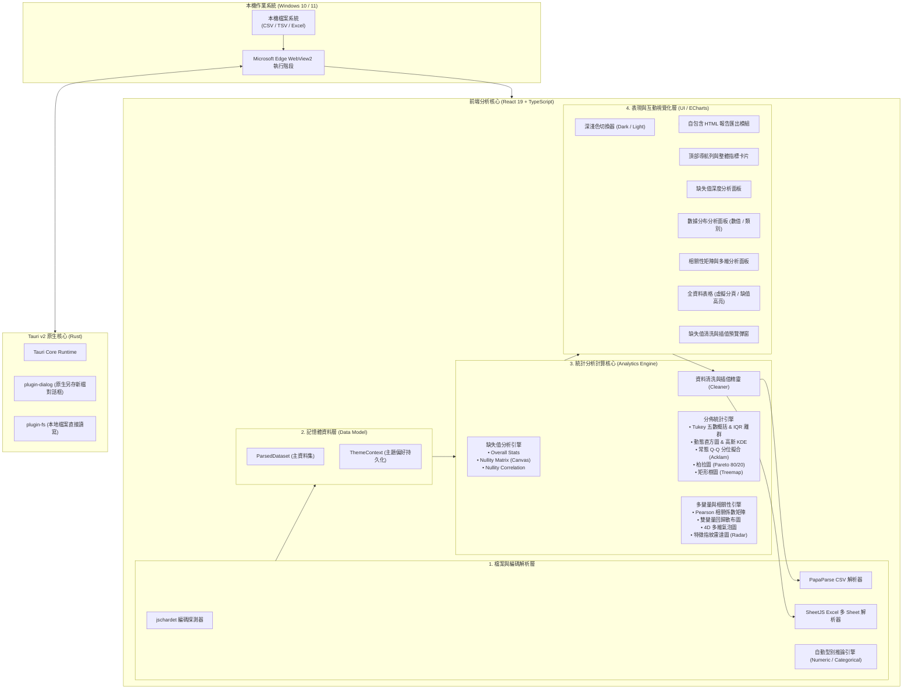
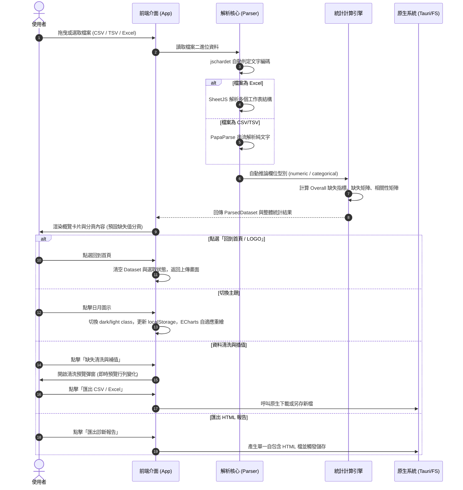
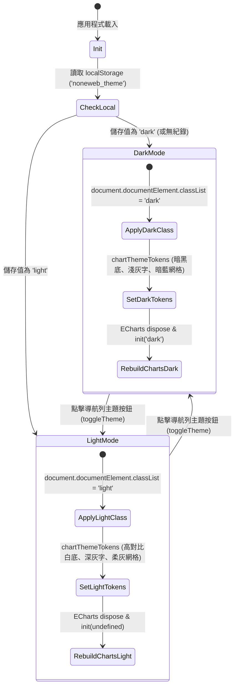

# NoneWeb Data Analyzer 系統規格書 (System Specification)

> **版本**：v1.2.0  
> **最後更新日期**：2026 年 9 月  
> **軟體型態**：免安裝綠色版可攜式桌面資料分析與品質診斷軟體 (Portable Desktop App)  
> **適用平台**：Windows 10 / 11 (x64)  
> **定位**：100% 本地離線、零雲端依賴、無 API Key 消耗的現代化資料診斷與探索性分析 (EDA) 工具

---

## 目錄 (Table of Contents)

1. [系統概述與設計原則 (System Overview & Design Principles)](#1-系統概述與設計原則)
2. [系統架構與技術棧 (System Architecture & Tech Stack)](#2-系統架構與技術棧)
3. [核心資料模型與型別規格 (Data Models & Type Specifications)](#3-核心資料模型與型別規格)
4. [核心演算法與計算引擎 (Core Algorithms & Analytics Engines)](#4-核心演算法與計算引擎)
5. [系統流程與狀態流轉 (Workflows & State Transitions)](#5-系統流程與狀態流轉)
6. [功能模組與視覺化圖表規格 (Functional Modules & Charts Specification)](#6-功能模組與視覺化圖表規格)
7. [全域深淺色主題規格 (Theme System Specification)](#7-全域深淺色主題規格)
8. [建置、打包與交付規格 (Build, Package & Delivery)](#8-建置打包與交付規格)

---

## 1. 系統概述與設計原則

### 1.1 系統目標
**NoneWeb Data Analyzer** 旨在解決傳統資料分析工具（如 Python Jupyter、Pandas、Seaborn、Missingno）環境部署繁複，以及第三方雲端分析工具存在機密資料外洩風險的痛點。提供一個「下載即用、單一可執行檔、完全離線本機計算」的現代化資料品質體檢與探索性分析 (EDA) 桌面軟體。

### 1.2 核心設計原則
1. **零雲端依賴與絕對隱私 (100% Zero-Cloud / Offline First)**：
   所有檔案解析、統計運算、分佈擬合與圖表渲染皆在本地記憶體中進行，不發出任何外部網路請求，拔除網路線依然具備完整功能。
2. **免安裝可攜性 (Portable & Lightweight)**：
   以 Rust + Webview2 (Tauri v2) 技術建置，輸出僅約 9MB 的單一 `.exe` 執行檔，無需安裝 Python、Node.js 或任何 Runtime。
3. **編碼容錯與本地化相容**：
   內建文字編碼自動探測，相容繁體中文 `Big5`、簡體中文 `GBK` 與通用 `UTF-8`，徹底解決中文資料分析時常出現的亂碼問題。
4. **雙主題高可讀性 (Dark/Light Native Theme)**：
   支援全域深色模式（極客沉浸感）與淺色模式（高對比白底），圖表元素與 UI 元件雙向即時調色。

---

## 2. 系統架構與技術棧

### 2.1 技術棧清單

| 領域 | 技術 / 函式庫 | 版本 | 用途說明 |
|---|---|---|---|
| **原生核心** | Tauri | v2.11.x | 輕量化桌面原生外殼、系統檔案對話框、原生檔案系統存取 |
| **原生語言** | Rust | 1.8x+ | 高效能 release 編譯、單一檔案打包 |
| **前端框架** | React | 19.2.x | 宣告式 UI 元件架構、虛擬 DOM 渲染 |
| **型別系統** | TypeScript | ~6.0.x | 全靜態型別約束與資料結構介面定義 |
| **建置工具** | Vite | 8.2.x | 極速前端模組熱更新與生產環境打包編譯 |
| **樣式引擎** | Tailwind CSS | 4.3.x | 現代化實用優先 CSS、自適應深淺色變體 (`@custom-variant dark`) |
| **圖表引擎** | Apache ECharts | 6.1.x | 高效能 Canvas/SVG 資料視覺化、客製化互動主題 |
| **圖表封裝** | 自研 EChartWrapper | - | 響應式容器監控、動態深淺色主題切換重繪 |
| **檔案解析** | PapaParse | 5.7.x | 本地高容錯 CSV / TSV 串流解析與分隔符探測 |
| **試算表解析** | SheetJS (xlsx) | 0.18.x | 本地 Excel (`.xlsx`, `.xls`) 多工作表解析與匯出 |
| **編碼識別** | jschardet | 3.1.x | 二進位字元集自動探測 (UTF-8, Big5, GBK, Windows-1252) |
| **圖標庫** | Lucide React | 1.41.x | 現代簡約向量圖標集合 |

### 2.2 系統架構拓撲圖



---

## 3. 核心資料模型與型別規格

系統核心型別定義於 `src/types/data.ts`：

### 3.1 基礎欄位與資料集結構
```typescript
export type ColumnType = 'numeric' | 'categorical' | 'datetime' | 'boolean';

export interface ParsedDataset {
  filename: string;
  fileSize: number;
  encoding: string;
  delimiter?: string;
  sheetNames?: string[];
  activeSheet?: string;
  columns: string[];
  columnTypes: Record<string, ColumnType>;
  rows: Record<string, any>[];
}
```

### 3.2 統計分析指標型別
```typescript
// 欄位缺失統計
export interface ColumnMissingStat {
  name: string;
  type: ColumnType;
  total: number;
  missingCount: number;
  missingRate: number; // 0 ~ 100 (%)
  validCount: number;
  uniqueCount: number;
}

// 整體資料集缺失統計
export interface OverallMissingStat {
  totalRows: number;
  totalCols: number;
  totalCells: number;
  totalMissingCells: number;
  overallMissingRate: number; // 0 ~ 100 (%)
  completeRowsCount: number;
  completeRowsRate: number; // 0 ~ 100 (%)
  colsWithMissingCount: number;
}

// 數值特徵統計
export interface NumericStats {
  count: number;
  missing: number;
  mean: number;
  std: number;
  variance: number;
  min: number;
  q1: number;
  median: number;
  q3: number;
  max: number;
  iqr: number;
  skewness: number;
  kurtosis: number;
  outliersCount: number;
  outlierIndices: number[];
  histogram: HistogramBin[];
  kde: { x: number; y: number }[];
  cdf: { x: number; y: number }[];
  qqPlot?: QQPlotData;
}

// 常態機率 Q-Q 圖資料
export interface QQPlotData {
  points: [number, number][]; // [理論 Z 分位數, 樣本分位數]
  line: [number, number][];   // 理論對角基準線端點
  slope: number;
  intercept: number;
  rSquared: number;           // 決定係數 R^2 (0~1)
  normalityStatus: 'likely_normal' | 'moderate_deviation' | 'heavy_skewed';
}

// 類別特徵統計與柏拉圖
export interface CategoryFrequency {
  value: string;
  count: number;
  percentage: number;
}

export interface ParetoItem {
  value: string;
  count: number;
  percentage: number;
  cumCount: number;
  cumPercentage: number;     // 累計百分比 (0~100%)
}

export interface CategoricalStats {
  count: number;
  missing: number;
  uniqueCount: number;
  mode: string;
  modeCount: number;
  frequencies: CategoryFrequency[];
  pareto: ParetoItem[];
}

// 相關性矩陣與多維雷達
export interface CorrelationMatrix {
  columns: string[];
  matrix: number[][]; // 皮爾森相關係數 (-1 ~ 1)
}

export interface RadarData {
  indicators: { name: string; max: number }[];
  series: { name: string; value: number[] }[];
}
```

---

## 4. 核心演算法與計算引擎

### 4.1 缺失值識別演算法 (`isValueMissing`)
系統判定儲存格值為缺失 (Missing/NULL) 的條件：
- 嚴格為 `null` 或 `undefined`。
- 經過 Trim 後為空字串 `""`。
- 不區分大小寫之特定缺失標記：`"nan"`, `"null"`, `"none"`, `"na"`, `"#n/a"`, `"#value!"`。

### 4.2 欄位型態自動推論演算法 (`inferColumnType`)
1. 提取該欄位前 100 筆非缺失樣本值。
2. 計算純數值轉換成功率：若數值轉換成功比例 $\ge 85\%$，推論為 `numeric`。
3. 檢查布林值關鍵字 (`true`/`false`, `0`/`1`, `yes`/`no`)，若純布林值比例 $\ge 90\%$，推論為 `boolean`。
4. 檢查 ISO 日期或常見日期格式字串，若匹配率 $\ge 80\%$，推論為 `datetime`。
5. 其餘情況推論為類別型 `categorical`。

### 4.3 數值分佈與極值演算法
- **五數概括與四分位數**：
  採用加權線性內插分位數算法（R Type 7 / Excel 默認分位數公式）：
  $$p \in [0, 1], \quad \text{index} = (n - 1) \times p$$
  $$Q(p) = x_{\lfloor \text{index} \rfloor} \times (1 - w) + x_{\lceil \text{index} \rceil} \times w, \quad w = \text{index} - \lfloor \text{index} \rfloor$$
- **IQR 異常值 (Tukey Outliers)**：
  $$\text{IQR} = Q_3 - Q_1$$
  $$\text{正常邊界} \in [Q_1 - 1.5 \times \text{IQR}, \quad Q_3 + 1.5 \times \text{IQR}]$$
  凡超出邊界之樣本皆標記為離群值 (Outliers)。
- **偏態 (Skewness) 與峰度 (Kurtosis)**：
  採用無偏樣本三階與四階動差計算（相容 Fisher-Pearson 偏態係數）。
- **高斯核密度估計 (Gaussian KDE)**：
  採用 Silverman 頻寬選擇法則 (Rule of Thumb)：
  $$h = 1.06 \times \sigma \times n^{-1/5}$$
  核函數採用標準高斯核：
  $$K(u) = \frac{1}{\sqrt{2\pi}} e^{-\frac{1}{2}u^2}, \quad \hat{f}(x) = \frac{1}{n \cdot h} \sum_{i=1}^{n} K\left(\frac{x - X_i}{h}\right)$$
  並自動縮放映射至直方圖頻率軸尺度。

### 4.4 常態 Q-Q 分位圖演算法 (`normInv` & `calcQQPlot`)
- **標準常態反函數 (Acklam 有理逼近法)**：
  演算法分為低端區間 ($p < 0.02425$)、中段核心區間 ($0.02425 \le p \le 0.97575$) 與高端區間 ($p > 0.97575$)，最大絕對誤差小於 $1.15 \times 10^{-9}$，無需載入龐大外部 C/WASM 數學庫。
- **參考基準線擬合**：
  基準線斜率以樣本四分位距與理論標準常態四分位距（$Z_{0.75} - Z_{0.25} \approx 1.34898$）之比決定：
  $$\text{Slope} = \frac{Q_3 - Q_1}{2 \times 0.67449}, \quad \text{Intercept} = Q_1 - \text{Slope} \times (-0.67449)$$
- **常態擬合決定係數 $R^2$**：
  計算點集至參考線的殘差平方和 ($SS_{res}$) 與總平方和 ($SS_{tot}$)，輸出 $R^2 = 1 - \frac{SS_{res}}{SS_{tot}}$。
  - $R^2 \ge 0.95$ 且 $|\text{Skewness}| \le 0.5 \implies$ `likely_normal`（高度符合常態）
  - $R^2 \ge 0.88$ 且 $|\text{Skewness}| \le 1.2 \implies$ `moderate_deviation`（輕度偏離常態）
  - 其餘情況 $\implies$ `heavy_skewed`（顯著偏離常態 / 厚尾）

### 4.5 皮爾森相關係數矩陣演算法 (`calcPearsonCorrelation`)
針對所有數值型欄位配對 $(X, Y)$，僅取兩者皆非缺失之有效成對樣本：
$$r_{xy} = \frac{\sum (x_i - \bar{x})(y_i - \bar{y})}{\sqrt{\sum (x_i - \bar{x})^2} \sqrt{\sum (y_i - \bar{y})^2}}$$

---

## 5. 系統流程與狀態流轉

### 5.1 主要使用者操作流程 (Main User Journey)



### 5.2 主題狀態流轉 (Theme State Flow)



---

## 6. 功能模組與視覺化圖表規格

系統主畫麵包含四大工作分頁與全域工具列：

### 6.1 頂部全域導航列 (Top Navigation)
- **回到首頁功能**：左側 LOGO 與右上角「回到首頁」按鈕隨時重設分析狀態。
- **缺失清洗與補值精靈按鈕**：開啟互動式清洗視窗。
- **HTML 診斷報告按鈕**：一鍵產生獨立體檢報告。
- **深淺色主題切換按鈕**：高質感太陽 ☀️ / 月亮 🌙 圖示按鈕。

### 6.2 檔案上傳與切換區 (File Uploader)
- 支援拖曳上傳與點選本機檔案。
- **Excel 多 Sheet 切換器**：動態下拉選單，點選立即重新解析指定工作表。
- **編碼手動覆寫器**：支援 `UTF-8`、`Big5`、`GBK`、`Shift-JIS` 等即時切換。
- **一鍵載入示範資料**：內建醫療健檢示範數據（含數值、類別與多種缺失樣態）。

### 6.3 分頁一：缺失值深度分析 (Missing Values Tab)
1. **資料指標概覽 (Overview Metrics)**：
   - 資料維度 (Rows $\times$ Cols)、儲存格總數、檔案大小。
   - 總缺失值數、整體缺失率 (%)。
   - 完整列數 (Complete Cases) 及完整率 (%)。
   - 含有缺失值的欄位數量。
2. **缺失值矩陣圖 (Missingno Matrix)**：
   - 高效能 HTML5 Canvas 渲染。
   - 垂直方向表示列（按原始順序由上而下），水平方向表示欄位。
   - 紅色像素代表缺失值，灰/深藍像素代表有效值。
   - 右側附帶「列完整度曲線 (Sparkline)」，即時反映特定列的健康度。
   - 滑鼠懸浮即時顯示具體欄位名稱、估計列號與有效/缺失狀態。
3. **缺失率排序長條圖 (Missing Bar Chart)**：
   - 由高至低排列所有欄位缺失率。
   - 支援「缺失百分比 (%)」與「缺失筆數 (Count)」一鍵切換。
   - 嚴重度色彩分級（綠色 0%、藍色 $<5\%$、黃色 $5\% \sim 25\%$、紅色 $>25\%$）。
4. **缺失共現關聯熱力圖 (Nullity Correlation)**：
   - 計算各欄位缺值布林旗標的相關係數。
   - 直觀識別 MCAR（隨機缺失）與 MAR（相依關聯缺失）。

### 6.4 分頁二：數據分布分析 (Distribution Tab)
配備左側「欄位搜尋與篩選清單」，支援按名稱搜尋及類型（數值/類別）過濾。

#### A. 數值型欄位 (Numeric View)
- **指標列**：樣本總數、平均值、標準差、中位數、IQR、偏態、峰度、離群值筆數。
- **直方圖 (Histogram) + 核密度估計 (KDE)**：
  - 雙軸融合呈現資料形狀。
  - 支援 **分箱數 (Bins) 互動滑桿**（10 ~ 60，步長 5），滑動秒級更新直方圖分箱。
- **五數概括箱線圖 (Boxplot)**：
  - 直觀展示 Min, Q1, Median, Q3, Max 與 IQR 展距。
  - 右上角標記離群值警示徽章。
- **累積分布函數 (CDF)**：
  - 呈現各數值門檻以下的累積百分比面積曲線。
- **常態機率 Q-Q 圖 (Normal Q-Q Plot) ★新增★**：
  - 散布點對照理論高斯分位數與樣本分位數。
  - 紅色虛線理論基準線。
  - 顯示決定係數 $R^2$ 及常態符合度狀態徽章。

#### B. 類別型欄位 (Categorical View)
- **指標列**：有效類別數、唯一值種類 (Unique)、最常見類別 (眾數 Mode)、眾數佔比。
- **四種視圖切換列**：
  1. **四圖並列 (All)**：長條圖、環形圖、柏拉圖、矩形樹圖同屏展示。
  2. **Top 頻率長條圖 (Bar Chart)**：前 N 名（Top 5/10/20）降冪出現次數長條圖。
  3. **類別比例環形圖 (Donut Pie)**：中心鏤空環形比例圖，附帶高亮圖例。
  4. **二八法則柏拉圖 (Pareto Chart) ★新增★**：結合頻率柱狀圖與累計百分比折線，標示 **80% 核心界限** 輔助線。
  5. **類別矩形樹狀圖 (Treemap) ★新增★**：以階梯色彩矩形面積呈現各分類比重，極佳解決多類別視覺重疊問題。
- **詳細類別頻率清單表格**：展示前 50 名分類名稱、出現次數、百分比與視覺比例條。

### 6.5 分頁三：相關矩陣與多變量分析 (Correlation & 4D Tab)
1. **Pearson 相關係數矩陣熱力圖**：
   - 支援 $-1.0$ (負相關/紅) 至 $+1.0$ (正相關/綠) 漸變色階。
   - 格線附帶精確數值標籤（小於 12 欄時自動顯示）。
2. **雙變量散布圖 (Scatter Plot) 與線性回歸趨勢線**：
   - 自由指定 X 軸與 Y 軸數值欄位。
   - 自動計算最小平方法 (OLS) 回歸方程式：$y = ax + b$ 並繪製虛線趨勢線。
3. **四維多變量氣泡圖 (4D Bubble Chart) ★新增★**：
   - 同步映射 4 個維度：
     - **X 軸**：任意數值特徵
     - **Y 軸**：任意數值特徵
     - **氣泡大小**：第 3 個數值特徵（半徑動態縮放 6px ~ 36px）
     - **氣泡色彩**：第 4 個類別特徵分組（以不同色系展示群集特徵）
4. **特徵統計指紋雷達圖 (Feature Profile Radar) ★新增★**：
   - 提取各數值特徵的 5 項統計指標：相對均值、變異係數 (CV)、中位數水準、IQR 展距、異常值率。
   - Min-Max 歸一化至 0~100 分數尺標。
   - 支援使用者任意勾選 2 至 6 個數值欄位同圖疊加比對。

### 6.6 分頁四：原始資料與高亮檢視 (Data Explorer Tab)
- 全欄位資料即時網格檢視。
- 支援任意關鍵字全域即時搜尋。
- **「僅顯示含缺失值列」核取方塊**：快速定位髒資料列。
- **欄位單擊多向排序**：正序、倒序、還原。
- 缺失值儲存格高亮標記：紅色 `<NULL>` 徽章提示。
- 虛擬客戶端分頁器（每頁固定 50 筆，秒級響應）。

### 6.7 互動清洗與插值精靈 (Missing Cleaner Modal)
- **剔除策略**：
  - 剔除任何含有缺失值的列 (Drop NA Rows)。
  - 剔除高缺失率欄位門檻（滑桿 10% ~ 100%）。
- **數值型補值**：保留缺值 / 平均值 (Mean) / 中位數 (Median) / 補零 (Zero)。
- **類別型補值**：保留缺值 / 眾數 (Mode) / 自訂字串常數（例如：`未知`）。
- **即時預覽面板**：即時試算列數變化、欄數變化、剔除數量。
- **匯出與套用**：支援直接將清洗後資料另存為 CSV / Excel，或直接套用更新主畫面。

---

## 7. 全域深淺色主題規格

### 7.1 主題配置規格

| 元件屬性 | 深色模式 (Dark Mode) | 淺色模式 (Light Mode) |
|---|---|---|
| **主背景 (Main Background)** | `#090d16` / `#020617` | `#f8fafc` |
| **卡片背景 (Card Background)** | `#0f172a` (Slate 900) | `#ffffff` (White) |
| **邊框色彩 (Border Color)** | `#1e293b` (Slate 800) | `#e2e8f0` (Slate 200) |
| **主文字色彩 (Primary Text)** | `#f8fafc` (Slate 100) | `#0f172a` (Slate 900) |
| **次要文字色彩 (Secondary Text)** | `#94a3b8` (Slate 400) | `#64748b` (Slate 500) |
| **ECharts 坐標軸線** | `#334155` (Slate 700) | `#e2e8f0` (Slate 200) |
| **ECharts 分割格線** | `#1e293b` (Slate 800) | `#f1f5f9` (Slate 100) |
| **ECharts Tooltip 背景** | `rgba(15, 23, 42, 0.95)` | `rgba(255, 255, 255, 0.97)` |
| **缺失值畫布有效點** | `#334155` (深灰藍) | `#cbd5e1` (淡灰) |
| **缺失值警示色** | `#ef4444` (亮紅) | `#ef4444` (鮮紅) |

### 7.2 持久化原則
- 存取鍵名：`localStorage.getItem('noneweb_theme')`。
- 初次進入系統若無紀錄，自動偵測系統色彩模式（`prefers-color-scheme: light`），否則預設使用深色模式。
- 同步在 `document.documentElement` 設定 `class="dark"` 或 `class="light"` 及 `data-theme="dark|light"`。

---

## 8. 建置、打包與交付規格

### 8.1 專案目錄結構
```text
NoneWeb-Data-Analyzer/
├── NoneWeb-Data-Analyzer.exe    # 最終交付之免安裝綠色版執行檔 (~9MB)
├── build.bat                    # 一鍵全自動建置腳本
├── package.json                 # 前端依賴與腳本定義
├── vite.config.ts               # Vite 建置配置 (@tailwindcss/vite)
├── src/
│   ├── main.tsx                 # 應用程式掛載入口 (ThemeProvider)
│   ├── App.tsx                  # 主應用頁面、導航與分頁管理
│   ├── index.css                # Tailwind 引入與深淺色滾動條樣式
│   ├── context/
│   │   └── ThemeContext.tsx     # 主題狀態全域上下文與切換器
│   ├── types/
│   │   └── data.ts              # 資料結構與統計型別介面
│   ├── utils/
│   │   ├── parser.ts            # PapaParse / SheetJS / jschardet 整合解析
│   │   ├── statistics.ts        # 統計核心 (KDE, Q-Q Plot, Radar, Pareto)
│   │   ├── correlation.ts       # 皮爾森相關係數與散布圖資料計算
│   │   ├── missingAnalysis.ts   # 缺失矩陣與共現關聯計算
│   │   ├── cleaner.ts           # 清洗與補值演算法
│   │   ├── chartTheme.ts        # ECharts 深淺色配色令牌工具
│   │   └── exportReport.ts      # HTML 診斷分析報告產生器
│   └── components/
│       ├── FileUploader.tsx     # 上傳拖放區與工具列
│       ├── OverviewMetrics.tsx  # 資料集統計概覽卡片組
│       ├── Common/
│       │   ├── EChartWrapper.tsx # ECharts 響應式主題包裝組件
│       │   └── StatCard.tsx     # 統計指標小卡組件
│       ├── MissingValueTab/     # 分頁 1: 缺失分析
│       ├── DistributionTab/     # 分頁 2 & 3: 數據分布與相關矩陣
│       │   ├── QQPlotView.tsx   # [新增] 常態 Q-Q 分位圖
│       │   ├── ParetoChartView.tsx # [新增] 80/20 柏拉圖
│       │   ├── CategoryTreemapView.tsx # [新增] 類別樹狀圖
│       │   ├── BubbleChart4DView.tsx   # [新增] 四維氣泡圖
│       │   └── FeatureRadarView.tsx    # [新增] 特徵雷達圖
│       └── DataGridTab/         # 分頁 4: 原始資料檢視表格
└── src-tauri/                   # Tauri 原生配置與 Rust 核心
    ├── Cargo.toml               # Rust 依賴配置
    ├── tauri.conf.json          # 視窗尺寸、標題與權限配置
    └── src/
        └── main.rs              # Rust 原生主程式入口
```

### 8.2 建置流程指令
1. **前端生產編譯**：
   ```bash
   npm run build
   # 執行 tsc -b 進行型別檢查，隨後 vite build 產生優化後的 dist/ 資源
   ```
2. **Rust 原生 Release 編譯**：
   ```bash
   cd src-tauri
   cargo build --release
   # 編譯產生 src-tauri/target/release/NoneWeb-Data-Analyzer.exe
   ```
3. **一鍵發布腳本**：
   直接在專案根目錄執行 `build.bat`，自動依序完成環境檢查、進程清理、前端編譯、Rust 編譯，並自動將產出的執行檔複製為根目錄下的 `NoneWeb-Data-Analyzer.exe`。
