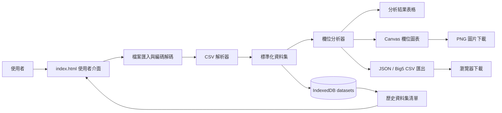
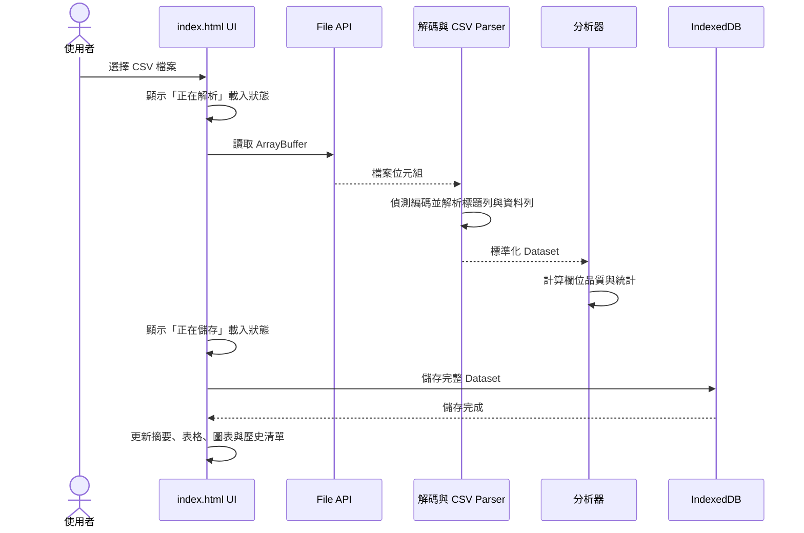
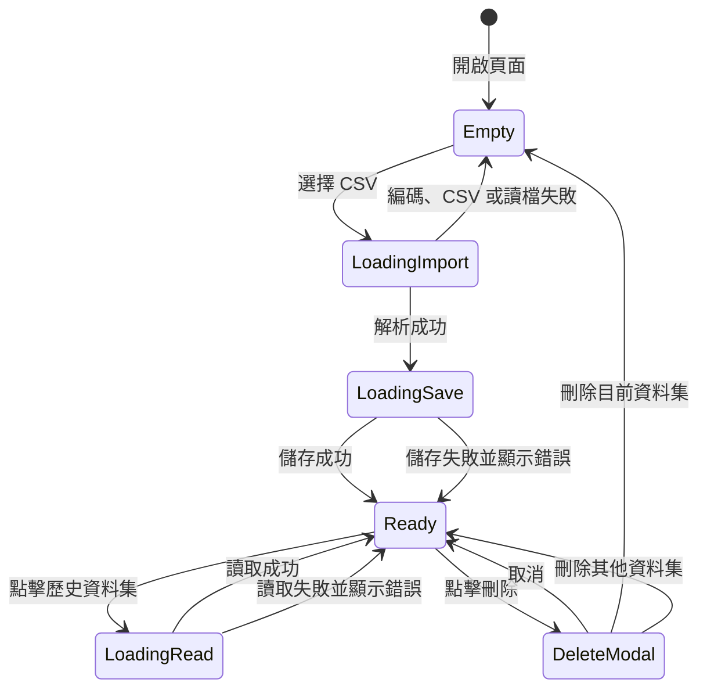

Software Requirements Specification (SRS)

產品名稱：離線資料品質與分布分析工具 (Offline Data Analyzer)

版本: 1.3
日期: 2026-09-05
狀態: 已核准 (Approved)

1. 執行摘要 (Executive Summary)

本產品為一款完全免安裝、基於瀏覽器運行的單頁應用程式 (Single-Page Application, SPA)。其主要目的是讓使用者（如資料分析師、風控人員、稽核員）能在完全斷網的情況下，安全地匯入 CSV 檔案，並快速產出資料的品質報告與基礎統計分布。所有運算與儲存皆在使用者本機端完成，確保機密或敏感資料絕不會外洩至雲端伺服器。

2. 背景與目標 (Background & Goals)

2.1 問題陳述 (Problem Statement)

許多企業內部擁有高度機密的資料（如金融交易紀錄、個資），這些資料需要進行初步的清理與品質檢查。然而，市面上多數的資料分析工具或 SaaS 服務都需要將資料上傳至雲端，違反了企業的資安與合規政策。此外，要求非技術人員安裝 Python 環境 (如 Pandas) 或複雜的桌面軟體門檻過高。

2.2 產品目標 (Product Goals)

極致的資安: 實現 100% 本機端運算與儲存，無需網路連線即可運作。

零安裝門檻: 提供單一 HTML 檔案，使用者只需點擊即可在現代瀏覽器中開啟使用。

快速洞察: 自動辨識資料型態，並即時產出缺失值、數值分布統計與欄位視覺化圖表。

資料持久化: 提供本機端的歷史紀錄管理，方便使用者隨時切換與檢視過去上傳的資料集。

2.3 成功指標 (Success Metrics)

效能: 處理 10MB 以內（約數萬筆）的 CSV 檔案，解析與渲染時間在 5 秒內。

可用性: 支援主流現代瀏覽器 (Chrome, Edge, Firefox, Safari)。

3. 使用者與使用情境 (User Personas & Use Cases)

3.1 目標使用者 (Target Audience)

合規與稽核人員: 需要檢查資料是否有大量空值或異常極值，但不具備寫程式的能力。

資料工程師/分析師: 在將資料匯入正式資料倉儲前，需要一個輕量級工具進行快速的 Profile 檢查。

3.2 核心使用情境 (Key Use Cases)

匯入與分析: 使用者點擊「匯入新 CSV 檔案」，選擇本機檔案。系統讀取、解析、辨識欄位型態，並在畫面上顯示每個欄位的缺失率、數值統計（最大、最小、平均、標準差）與欄位圖表。

歷史紀錄檢視: 使用者關閉網頁後隔日重新開啟，透過左側邊欄看到昨天分析過的資料集，點擊後即可快速載入檢視，無需重新上傳檔案。

刪除機密資料: 使用者完成分析後，為了安全起見，點擊歷史紀錄旁的刪除按鈕，將該資料集從瀏覽器資料庫中徹底清除。

4. 產品功能需求 (Functional Requirements)

4.1 檔案匯入模組

REQ-1.1: 系統必須提供上傳 CSV 檔案的介面。

REQ-1.2: 系統必須能夠解析帶有標題列 (Header) 的 CSV 檔案。

REQ-1.3: 檔案解析過程必須在背景或使用非同步處理，並顯示 Loading 遮罩，避免畫面凍結。

4.2 資料處理與分析模組

REQ-2.1 [型態辨識]: 系統必須自動掃描每個欄位，若該欄位所有非空值皆可轉換為有效數字，則判定為「數值」型態；否則判定為「字串」型態。

REQ-2.2 [缺失值計算]: 系統必須計算每個欄位的空白、null、undefined 數量，並計算其佔總筆數的百分比 (缺失率)。

REQ-2.3 [數值統計]: 針對判定為「數值」的欄位，系統必須計算並顯示：最小值、P25、中位數、P75、最大值、平均值、標準差、零值數、負值數。字串欄位則顯示為 -。

REQ-2.4 [字串統計]: 系統必須針對每個欄位計算唯一值數；針對非空字串值，系統必須顯示前 5 常見值、最短長度與最長長度。

4.3 視覺化與呈現模組

REQ-3.1 [摘要資訊]: 畫面頂部必須顯示當前資料集的名稱、匯入時間、總筆數與總欄位數。

REQ-3.2 [結果表格]: 分析結果必須以表格呈現，並提供「品質」、「數值分布」、「字串分布」三種欄位群組切換。

REQ-3.3 [視覺凸顯]: 缺失值大於 0 時，必須以紅色醒目提示其數量與缺失率。

REQ-3.4 [搜尋與排序]: 系統必須提供欄位名稱搜尋，並支援依原始欄位順序、欄位名稱、型態、缺失率與唯一值數排序。

REQ-3.5 [分析結果匯出]: 系統必須支援將分析摘要匯出為 JSON 或 Big5 編碼 CSV。匯出內容不得包含原始資料列。

REQ-3.6 [欄位視覺化]: 系統必須提供單欄位圖表。數值欄位必須支援五數摘要圖與直方圖；字串欄位必須支援前 5 常見值長條圖。

REQ-3.7 [圖表圖片下載]: 系統必須支援將目前顯示的欄位圖表下載為 PNG 圖片。圖片產生與下載必須完全在瀏覽器本機端完成。

4.4 本機資料庫 (IndexedDB) 模組

REQ-4.1 [儲存]: 新匯入的資料集必須自動連同其 Metadata (檔名、時間、行列數) 與 Raw Data 儲存至 IndexedDB。

REQ-4.2 [讀取清單]: 應用程式啟動時，必須從 IndexedDB 讀取所有資料集的 Metadata，並渲染於左側邊欄，依時間由新到舊排序。

REQ-4.3 [載入特定資料]: 點擊側邊欄項目時，系統必須從 IndexedDB 提取該筆完整資料並重新執行分析渲染。

REQ-4.4 [刪除]: 使用者必須能夠刪除特定的資料集。點擊刪除時需跳出自訂確認對話框，確認後將資料從 IndexedDB 中移除。

REQ-4.5 [歷史搜尋]: 系統必須提供歷史資料集檔名搜尋，方便使用者在多筆本機資料集間切換。

5. 非功能需求 (Non-Functional Requirements)

5.1 效能 (Performance)

系統設計應盡量減少對記憶體的過度消耗。在計算統計值時應使用迴圈而非過度依賴耗費記憶體的陣列操作 (如避免在巨量資料下使用 map 串接 reduce)。

DOM 渲染應使用 DocumentFragment 批次更新，以優化瀏覽器重繪 (Repaint/Reflow) 效能。

5.2 安全性與隱私 (Security & Privacy)

核心原則: 絕對禁止任何外部 API 呼叫或資料外傳 (Analytics 或 Tracking code 亦不允許)。

工具完全依賴 HTML5 File API 與 IndexedDB。

5.3 相容性 (Compatibility)

支援所有支援 IndexedDB 與 ES6 JavaScript 語法的現代瀏覽器。

由於依賴本地儲存，系統需提示使用者若在「無痕模式/隱私模式」下執行，資料庫功能可能受到限制或關閉後消失。

5.4 架構與交付 (Architecture & Delivery)

交付物必須是單一個 .html 檔案。

CSS 樣式必須內嵌於單一 HTML 檔案，不得引入 CDN 或外部樣式資源。

CSV 解析必須在瀏覽器本機端以內嵌 JavaScript 完成，不得引入 CDN、外部 API 或網路依賴。

5.5 系統架構 (System Architecture)

本系統採單頁、瀏覽器本機執行架構。所有畫面、樣式、資料處理與儲存介面均封裝於 `index.html`，不依賴後端服務、建置工具、套件管理器或網路資源。



系統分為以下責任區塊：

| 區塊 | 主要責任 | 實作邊界 |
| --- | --- | --- |
| 使用者介面層 | 顯示側邊欄、摘要、表格、圖表、載入遮罩與刪除 Modal，接收使用者操作 | DOM event listener、狀態顯示與畫面重繪 |
| 檔案輸入層 | 讀取本機檔案並辨識 UTF-8、UTF-8 BOM、UTF-16LE、UTF-16BE、Big5/CP950 | File API、TextDecoder |
| CSV 解析層 | 解析標題列、逗號、換行、引號與雙引號跳脫，產生標準化 rows | 內嵌 `parseCsv` |
| 分析層 | 判斷欄位型態、計算品質指標、數值統計與字串常見值 | 內嵌 `analyzeDataset` |
| 視覺化層 | 將分析結果轉為五數摘要、直方圖或常見值長條圖模型並繪製 Canvas | 不使用外部圖表套件 |
| 持久化層 | 儲存、讀取、列出與刪除完整資料集 | IndexedDB `offline-data-analyzer` / `datasets` |
| 匯出層 | 將分析摘要轉為 JSON、Big5 CSV，或將目前 Canvas 轉為 PNG | Blob、URL.createObjectURL、瀏覽器下載 |

5.6 執行時狀態與資料模型 (Runtime State & Data Model)

系統維護一份前端執行狀態，主要狀態如下：

| 狀態 | 內容 |
| --- | --- |
| `db` | IndexedDB 連線；初始化失敗時停用匯入並顯示錯誤 |
| `datasets` | 歷史資料集 Metadata 清單，依匯入時間由新到舊排列 |
| `activeDataset` | 目前選取的完整資料集 |
| `activeAnalysis` | 目前資料集各欄位的分析結果 |
| `activeView` | 表格檢視：`quality`、`numeric` 或 `string` |
| `activeChartColumn` | 目前圖表欄位 |
| `activeChartType` | 目前圖表類型：`summary`、`histogram` 或 `topValues` |
| `columnSearch` / `historySearch` | 欄位及歷史資料集搜尋字串 |
| `sortKey` / `sortDirection` | 分析表格排序欄位與方向 |

完整資料集記錄包含：`id`、`fileName`、`importedAt`、`encoding`、`rowCount`、`columnCount`、`headers` 與 `rows`。其中 `rows` 是以欄位名稱為 key 的物件陣列；IndexedDB 的側邊欄僅使用檔名、時間、行數、欄數與編碼等 Metadata 顯示。

分析結果每個欄位包含原始順序、欄位名稱、型態、缺失值數、缺失率、唯一值數；數值欄位另含最小值、P25、中位數、P75、最大值、平均值、標準差、零值數與負值數；字串欄位另含前 5 常見值、最短長度與最長長度。

5.7 主要使用流程 (End-to-End Flows)

匯入與分析流程：



歷史資料集流程：應用程式啟動時開啟資料庫並取得 Metadata；使用者點擊清單後，再以資料集 ID 讀取完整資料、重新分析並重繪畫面。搜尋只篩選目前已載入的 Metadata，不會修改資料庫內容。

欄位視覺化流程：分析完成後篩選可視覺化欄位；數值欄位預設五數摘要並可切換直方圖，字串欄位顯示前 5 常見值長條圖。切換欄位或類型時，只重新建立圖表模型並重繪 Canvas，不重新解析 CSV 或改寫 IndexedDB。

匯出流程：JSON 與 Big5 CSV 匯出的是分析摘要；PNG 匯出的是目前 Canvas 的影像內容。三種下載都由瀏覽器在本機建立 Blob 並觸發下載，不會上傳或呼叫外部服務。

5.8 例外與狀態轉移 (Error & State Handling)



錯誤訊息必須顯示於應用程式內，不使用原生 `alert` 或 `confirm`。空資料、缺少標題列、未關閉引號、無法辨識編碼、瀏覽器不支援 Big5/CP950、IndexedDB 不可用與 Canvas 不可用，均需提供可理解的繁體中文提示。載入遮罩在匯入、儲存、讀取與刪除完成或失敗後必須關閉。

6. 介面設計 (UI/UX Specifications)

6.1 佈局 (Layout)

左側邊欄 (Sidebar): 寬度固定，顯示本地資料庫狀態、歷史資料集清單、以及「匯入新檔案」的常駐按鈕。

右側主畫面 (Main Content): 包含頂部摘要區塊 (Header)、欄位視覺化區塊與佔滿剩餘空間的分析結果表格區塊 (Table Area)。

6.2 狀態提示

Empty State: 剛啟動且未選擇資料時，主畫面需顯示友善的插圖或文字，引導使用者匯入或選擇資料。

Loading State: 匯入、儲存、讀取與刪除過程中，需覆蓋半透明遮罩與旋轉動畫 (Spinner)，並帶有對應的文字提示 (如「正在解析 CSV 檔案...」)。

Modal: 刪除操作必須使用自訂的 HTML/CSS 模態框 (Modal)，取代瀏覽器原生的 alert 或 confirm。

6.3 畫面組成與互動順序 (Screen Composition)

```text
應用程式外框
├─ 左側 Sidebar
│  ├─ 品牌與功能說明
│  ├─ IndexedDB 狀態
│  ├─ 匯入新 CSV 檔案
│  ├─ 歷史資料集搜尋
│  └─ 歷史資料集清單／刪除按鈕
└─ 右側 Main
   ├─ 隱私提醒
   ├─ 資料集摘要：名稱、時間、編碼、筆數、欄位數
   └─ 分析結果面板
      ├─ Empty State 或分析工具列
      ├─ 欄位視覺化：欄位選擇、圖表類型、Canvas、下載 PNG
      └─ 分析結果表格：搜尋、排序、檢視分頁、JSON/CSV 匯出
```

有資料集時，Empty State 隱藏，分析工具列、欄位視覺化與結果表格顯示；尚未選擇資料集時則只顯示引導內容。刪除目前資料集後，摘要歸零、表格與圖表隱藏，畫面回到 Empty State。窄螢幕需允許摘要卡片、工具列與圖表控制項換行，表格與 Canvas 不得因文字而被截斷。

6.4 圖表規格 (Chart Specifications)

| 圖表 | 適用欄位 | 資料內容 | 顯示規則 |
| --- | --- | --- | --- |
| 五數摘要 | 數值 | 最小值、P25、中位數、P75、最大值 | 箱型摘要含數值標籤，單位為數值 |
| 直方圖 | 數值 | 有效數值依範圍分成 10 個區間 | 顯示各區間筆數；區間標籤需完整顯示起訖值 |
| 常見值 | 字串 | 前 5 個非空常見值及次數 | 長條圖顯示值與筆數，單位為筆數 |

圖表必須使用目前欄位的分析結果與原始資料計算，無有效資料時顯示提示並停用下載。Canvas 需保留固定繪圖高度與足夠左右邊界，依實際顯示寬度與裝置像素比調整解析度，避免標題、座標標籤或數值遭裁切。

7. 未來擴展性 (Future Enhancements / Out of Scope)

Out of Scope (v1.3): 多欄位散佈圖、完整圖表建構器、資料清洗/編輯功能、匯出處理後或清洗後的原始資料 CSV、圖表自訂配色與座標軸編輯。

未來可能方向: 增加多欄位交叉視覺化、資料篩選、正規表達式檢查與異常值標註功能。
